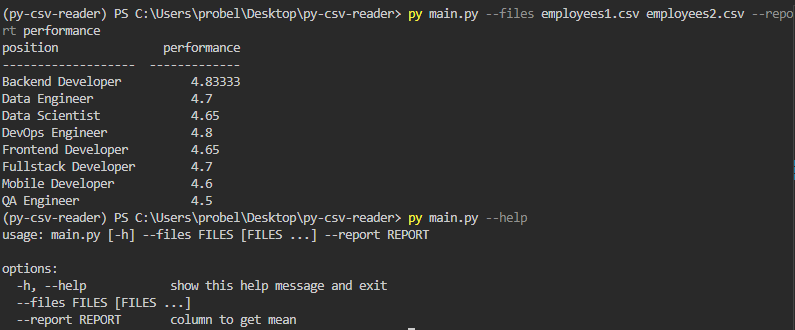

install requirements:

```
pip install -r requirements.txt
```

usage:
```
py main.py --files file1.csv file2.csv --report column_name_with_numeric_data
```

test w/ coverage:
```
pytest --cov=csvreader
```

usage example:
